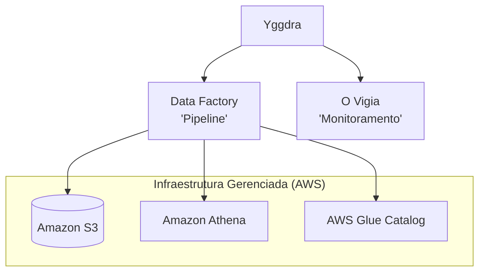
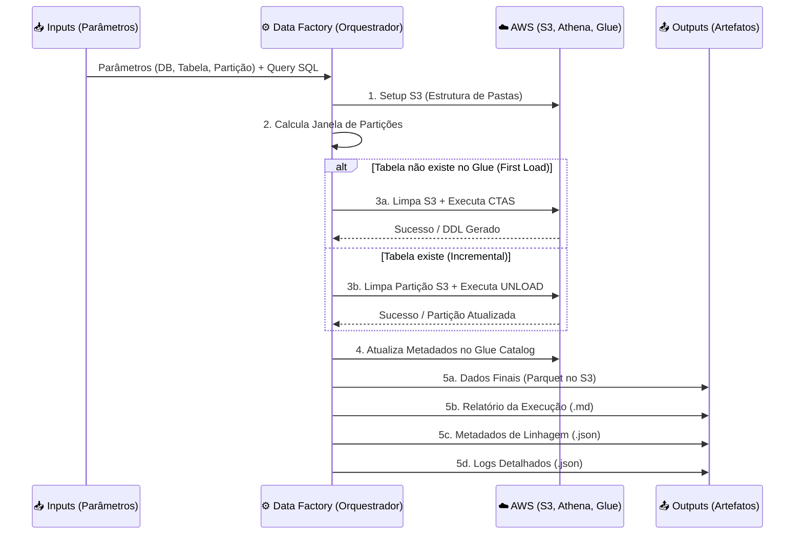

# 🌳 Yggdra - Data Factory

**A Origem e o Suporte de Todos os Mundos de Dados.**

`Yggdra` (uma derivação de *Yggdrasil*) é a biblioteca *core* de engenharia e analytics, projetada para ser a fundação de um ecossistema de produtos de dados escaláveis, resilientes e integrados. O **Data Factory** é o nosso principal produto derivado: uma infraestrutura automatizada que abstrai a complexidade do `boto3` e AWS, gerando pipelines de ponta a ponta com auditoria, logs e alertas nativos.

---

## 🎯 O que é o Data Factory?

O Data Factory atua como uma "Fábrica de SOT" (Source of Truth). Ele recebe uma query SQL e parâmetros de negócio e orquestra automaticamente toda a infraestrutura AWS (S3, Athena, Glue) para materializar, particionar e registrar a tabela final, lidando tanto com cargas iniciais (*First Load / CTAS*) quanto com incrementais (*UNLOAD*).

### 💡 Valor para Engenharia de Software
* **Abstração de Infraestrutura:** Elimina a necessidade de escrever código repetitivo (boilerplate) do `boto3`. Manipulação de S3, catálogos do Glue e execuções no Athena são nativos.
* **Padronização e Resiliência:** Força um padrão arquitetural único. O tratamento de erros é embutido, garantindo que falhas em partições não corrompam o *data lake*.
* **Observabilidade Nativa:** Geração automática de "Gêmeos Digitais" (Metadata de linhagem), relatórios de execução em Markdown e *timelines* completas de log em JSON.

### 💼 Valor para o Negócio
* **Time-to-Market Acelerado:** Criação de novas tabelas e pipelines em minutos, focando apenas na regra de negócio (SQL) e não na infraestrutura.
* **Auditoria e Confiança (SOT):** Todo dado gerado possui um relatório e metadado associado. O negócio sabe exatamente de onde o dado veio, quando foi atualizado e se houve falhas.
* **Eficiência de Custos:** Gestão inteligente de partições (reprocessamento sob demanda) e uso otimizado do AWS Athena, reduzindo scans desnecessários e custos de nuvem.

---

## 🏗️ Arquitetura do Ecossistema

A Yggdra é o **ponto de singularidade** de onde todos os produtos derivam suas capacidades.

## 🔄 Fluxo de Execução: Input & Output

O pipeline do Data Factory segue um ciclo de vida rigoroso, garantindo que as entradas (regras) se transformem em saídas (dados e logs) de forma limpa e auditável.

## 📦 Detalhamento dos Outputs

Ao finalizar uma execução, o Data Factory garante a entrega de 4 pilares no seu *Data Lake*:

1. **Dados Processados (`/data`):** O resultado do SQL materializado no S3, particionado e registrado no Glue/Athena, pronto para consumo.
2. **Metadata de Linhagem (`/metadata`):** Um JSON atuando como um "Gêmeo Digital" da execução (DDL original, origens, query aplicada e métricas de Duração/Sucesso).
3. **Relatórios (`/reports`):** Arquivos Markdown legíveis por humanos detalhando o status de cada partição processada.
4. **Logs de Execução (`/logs`):** A linha do tempo completa do sistema capturada pelo `GenericLogger`, persistida para auditoria técnica.

---

---

## ⚙️ Configuração do Job (`job_args`)

O dicionário de argumentos (`job_args`) é o painel de controle do Data Factory. Ele define exatamente qual dado será processado, onde será armazenado e como a janela de tempo será tratada. 

Os parâmetros são divididos entre **obrigatórios** (essenciais para a infraestrutura operar) e **opcionais** (para controle avançado de execução e janelas de dados).

### 🔴 Parâmetros Obrigatórios

Sem estes parâmetros, a pipeline não consegue identificar a origem da regra de negócio nem o destino dos dados no *Data Lake*.

| Parâmetro | Tipo | Descrição | Exemplo |
| :--- | :--- | :--- | :--- |
| `DB` | `str` | Nome do banco de dados de destino no AWS Glue Catalog. | `'workspace_db'` |
| `TABLE_NAME` | `str` | Nome da tabela (SOT) que será criada ou atualizada. | `'tb_vendas_consolidadas'` |
| `PATH_SQL_ORIGEM` | `str` | Caminho completo no S3 contendo o arquivo `.sql` com a regra de negócio. | `'s3://bucket/sql/query.sql'` |
| `REGION_NAME` | `str` | Região da AWS onde a infraestrutura (S3/Athena/Glue) será provisionada. | `'us-east-1'` |
| `PARTITION_NAME` | `str` | Nome da coluna de partição que o Data Factory usará para iterar os dados. | `'anomesdia'` |

### 🟢 Parâmetros Opcionais

Estes parâmetros oferecem flexibilidade para lidar com cenários reais de engenharia, como atraso na chegada de dados (defasagem), reprocessamento de janelas passadas e tagueamento de governança.

| Parâmetro | Tipo | Padrão | Descrição | Exemplo |
| :--- | :--- | :--- | :--- | :--- |
| `REPROCESSAMENTO` | `bool` | `False` | Ativa a recarga de partições passadas, ignorando a lógica padrão de pegar apenas a última. | `True` |
| `RANGE_REPROCESSAMENTO`| `int` | `0` | Define quantas partições para trás devem ser recarregadas (exige `REPROCESSAMENTO=True`). | `7` (Últimos 7 dias) |
| `DIA_CORTE` | `int` | `None` | Define um dia de limite/corte mensal para o processamento da janela de dados. | `15` |
| `DEFASAGEM` | `int` | `0` | Aplica um atraso (D-X) na captura da data atual para garantir que fontes *upstream* estejam prontas. | `1` (Processa D-1) |
| `BUCKET_NAME` | `str` | *Auto* | Força a escrita em um bucket S3 específico. Se omitido, usa o bucket default da conta. | `'meu-bucket-sot'` |
| `LOG_LEVEL` | `str` | `'INFO'` | Nível de verbosidade do `GenericLogger` para *troubleshooting*. | `'DEBUG'` |
| `JOB_NAME` | `str` | `None` | Nome amigável da pipeline para facilitar a busca nos logs e relatórios gerados. | `'ETL_Vendas_B2B'` |
| `OWNER` | `str` | `None` | Squad ou engenheiro dono do produto de dados (excelente para governança e alertas). | `'Squad Finance'` |

> 💡 **Engenharia na Prática:** A combinação de `DEFASAGEM` e `RANGE_REPROCESSAMENTO` é extremamente útil para tabelas que dependem de fontes com atualização tardia. Você pode, por exemplo, rodar o job sempre em D-2 (defasagem) e olhar 3 dias para trás (range) para garantir consistência eventual.

> 💡 **Dica de Engenharia:** Ao escrever seu SQL, você pode usar a sintaxe de formatação do Python para a partição (ex: `WHERE data = '{anomesdia}'`). O Data Factory, durante o loop incremental, substituirá essa variável automaticamente em tempo de execução (`sql_params={job_args['partition_name']: part}`).    

