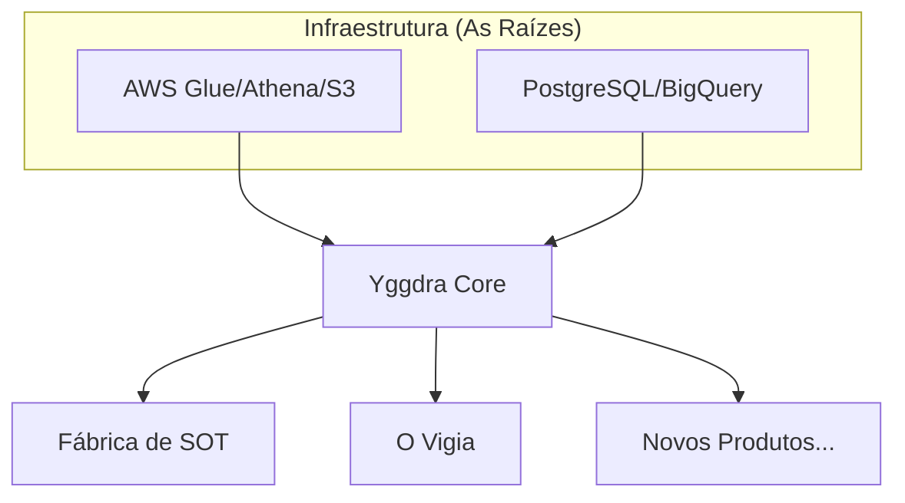

# 🌳 Yggdra

**A Origem e o Suporte de Todos os Mundos de Dados.**

`Yggdra` (uma derivação de *Yggdrasil*) é a biblioteca core de engenharia e analytics, projetada para ser a fundação de um ecossistema de produtos de dados escaláveis, resilientes e integrados.

---

## 🌌 O Conceito

Na mitologia nórdica, a Yggdrasil é a árvore colossal que sustenta os nove reinos. Sem ela, o cosmos entra em colapso. No nosso contexto, a **Yggdra** desempenha o mesmo papel:

* **As Raízes:** Nossas conexões profundas com fontes de dados (S3, Athena, Redshift, BigQuery).
* **O Tronco:** O core da biblioteca — logs, utilitários de AWS, conectores e tratamentos de erro padronizados.
* **Os Galhos:** Os produtos de dados que brotam dessa base, como a **Fábrica de SOT** e o **Vigia**.

## 🏗️ Arquitetura do Ecossistema

A Yggdra não é apenas uma coleção de funções; ela é o **ponto de singularidade** de onde todos os nossos produtos derivam suas capacidades.



### Por que Yggdra?

1. **Origem Única:** Evitamos a duplicidade de código. Se uma lógica de conexão com o Athena muda, ela muda na Yggdra, e todos os "mundos" (produtos) são atualizados.
2. **Constrição e Ordem:** A biblioteca impõe padrões rígidos de logs e performance, garantindo que nenhum produto cresça de forma desordenada.
3. **Sustentação:** Ela fornece o suporte necessário para que produtos complexos foquem apenas na regra de negócio, deixando o "trabalho pesado" de infraestrutura para o core.

---

## 🛠️ Funcionalidades Principais (Os Nove Reinos)

* **`yggdra.aws`**: Abstrações de alto nível para Boto3 (Glue, S3, Athena).
* **`yggdra.spark`**: Helpers para PySpark, otimização de workers e reparticionamento.
* **`yggdra.ops`**: Orquestração e monitoramento (o DNA do Vigia).
* **`yggdra.factory`**: Blueprints para criação de tabelas e camadas SOT.

---

## 🚀 Como um novo Produto nasce

Para criar um novo produto de dados baseado na Yggdra, basta importar a fundação:

```python
from yggdra.core import YggdraProduct
from yggdra.aws.athena import AthenaManager

class NovoProduto(YggdraProduct):
    def __init__(self):
        super().__init__(name="MeuNovoProduto")
        self.athena = AthenaManager()

    def run(self):
        self.logger.info("Iniciando processamento sustentado pela Yggdra...")

```

---

> *"Nove mundos eu conheci, nove raízes da árvore gloriosa que surge do seio da terra."*

---