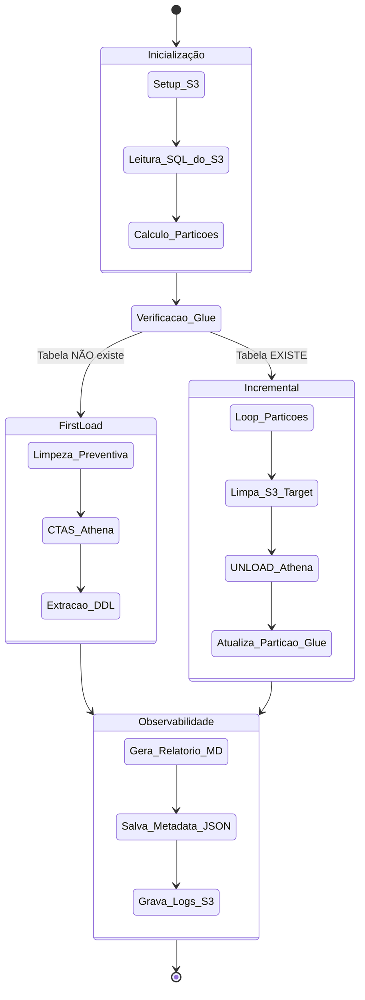

Com base em todo o contexto, código e arquitetura que discutimos até agora, aqui está um dossiê completo sobre o que é a **Yggdra**, suas capacidades e como ela transforma a engenharia de dados no seu ecossistema.

---

# 🌳 Yggdra: O Core de Engenharia e Analytics

A **Yggdra** não é apenas um script de ETL; ela é um *framework* proprietário e a espinha dorsal da sua infraestrutura de dados na AWS. Inspirada na árvore mitológica que sustenta os mundos, ela centraliza toda a complexidade de infraestrutura, permitindo que os engenheiros foquem puramente em regras de negócio (SQL) e na entrega de valor.

## 🏗️ 1. O Ecossistema Yggdra

A biblioteca é dividida em "camadas" lógicas:

* **Raízes (Conectores):** Interfaces padronizadas com AWS S3, Athena, Glue, Redshift e BigQuery.
* **Tronco (Core Utils):** Utilitários de log, tratamento de erros, formatação de tempo (`Clock`), cálculo dinâmico de datas (`DataUtils`) e abstração do `boto3`.
* **Galhos (Produtos):** * **Data Factory (Fábrica de SOT):** O orquestrador de pipelines que cria e atualiza tabelas finais (Source of Truth).
* **O Vigia:** (Mencionado na arquitetura, voltado para monitoramento/alertas).

---

## 🚀 2. Capacidades do Data Factory (O Orquestrador)

O Data Factory é a principal aplicação construída sobre a Yggdra. Ele é capaz de executar um fluxo de ponta a ponta de forma autônoma:

### 🔄 Orquestração Inteligente de Cargas (ETL/ELT)

* **First Load Automático (CTAS):** Se a tabela alvo não existe no AWS Glue Catalog, a Yggdra detecta isso e executa um `CREATE TABLE AS SELECT` (CTAS) no Athena, inferindo o schema automaticamente a partir da query e gerando o DDL de origem.
* **Cargas Incrementais (UNLOAD):** Se a tabela já existe, ela entra em modo incremental. Ela executa operações de `UNLOAD` do Athena para arquivos Parquet no S3.
* **Idempotência e Segurança:** Antes de gravar qualquer dado incremental, ela usa o `S3Manager` para deletar fisicamente (`clean_partition`) os dados daquela partição específica no S3, evitando duplicação de dados em caso de reprocessamento.

### 📅 Gestão Avançada de Partições e Tempo

Através do `DataUtils` e dos `job_args`, a Yggdra possui uma inteligência temporal robusta:

* **Injeção Dinâmica:** O parâmetro da partição (ex: `anomesdia`) é injetado automaticamente dentro da query SQL em tempo de execução.
* **Controle de Janelas:** Suporta defasagem (`DEFASAGEM`) para aguardar dados atrasados, limites de corte mensais (`DIA_CORTE`) e recálculo de janelas passadas (`RANGE_REPROCESSAMENTO` e `REPROCESSAMENTO`).

---

## 🔍 3. Observabilidade e Governança (O Diferencial)

A Yggdra brilha na forma como registra o que faz. Ela não gera apenas dados; ela gera confiança através de **4 pilares de saída**:

1. **O "Digital Twin" (MetadataManager):**
* Gera um arquivo JSON (`metadata.json`) que atua como o Gêmeo Digital da execução.
* **Lineage Completo:** Captura exatamente qual SQL foi executado, o DDL original e rastreia as **tabelas de origem** (Database, Tabela, Tipo e Valor da Partição) que alimentaram aquela rodada.
* **Métricas:** Salva a duração exata, contagem de partições com sucesso e falhas.

2. **Relatórios Humanos (ReportManager):**
* Gera um relatório em Markdown detalhando o status de cada partição processada e os tempos do Athena (`query_id`, `elapsed_sec`). Ideal para ser enviado para Slack/Teams ou lido por analistas.

3. **Logs de Auditoria (GenericLogger):**
* Em vez de apenas "printar" no console, o logger captura a linha do tempo completa em memória e salva um arquivo `log_execution_TIMESTAMP.json` no S3, permitindo *troubleshooting* profundo de falhas críticas.

4. **Isolamento de Infraestrutura (S3Manager):**
* Cria automaticamente a estrutura de pastas no estilo *Data Mesh/Lakehouse*: `/sql`, `/data`, `/temp`, `/logs`, `/metadata` e `/reports`.

---

## ⚙️ 4. Fluxograma de Arquitetura e Decisão

---

### Onde a Yggdra entrega maior valor?

* **Padronização:** Se a AWS mudar a API do boto3, você atualiza apenas a classe `AthenaManager` na Yggdra, e dezenas de pipelines (SOTs) são corrigidas automaticamente.
* **Velocidade:** Um engenheiro não precisa escrever 300 linhas de Python para fazer um ETL seguro. Ele passa um JSON de `job_args` com 6 parâmetros, aponta o SQL, e a Yggdra faz o resto.

Gostaria que eu montasse um template estruturado de um arquivo `.py` (como uma DAG do Airflow ou um Script Glue) demonstrando como a equipe deve importar e chamar a Yggdra no dia a dia para criar um novo pipeline em poucos minutos?