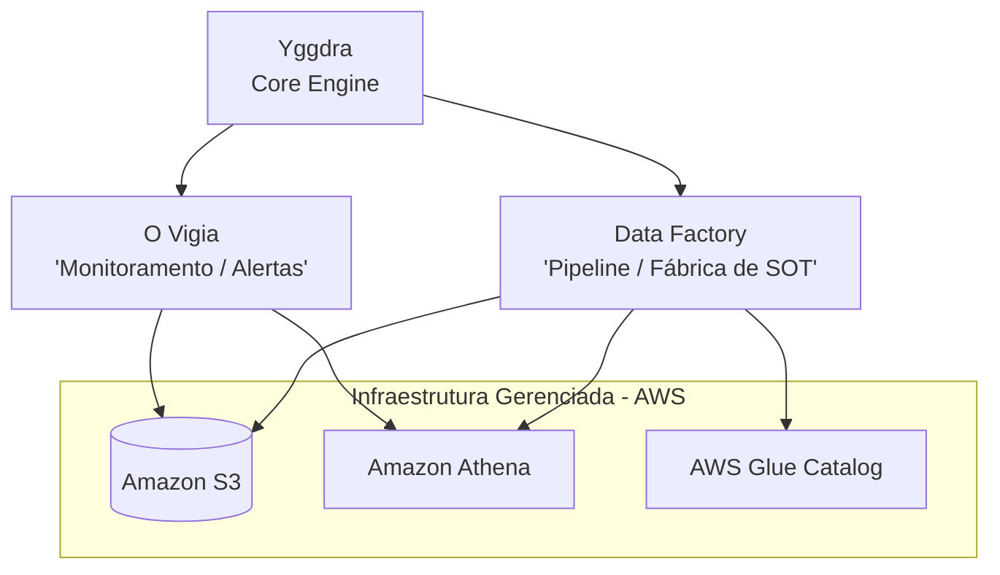
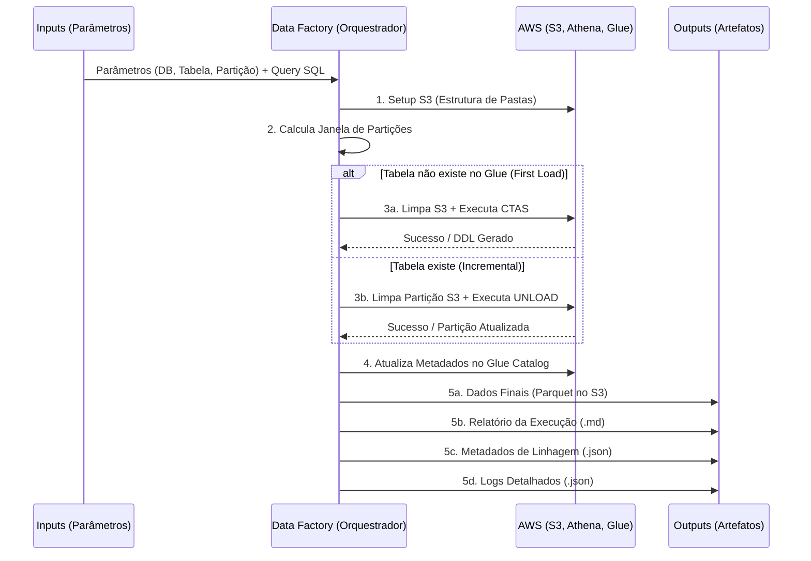

# YGGDRA - Documentacao Completa do Produto
**A Origem e o Suporte de Todos os Mundos de Dados.**
> *"Assim como a Yggdrasil sustenta os nove mundos na mitologia nórdica, a Yggdra sustenta todo o ecossistema de dados da organização."*
---
## Sumário
1. [Visão Geral](#1-visão-geral)
2. [Missão e Pilares](#2-missão-e-pilares)
3. [Arquitetura do Ecossistema](#3-arquitetura-do-ecossistema)
4. [Camadas da Yggdra](#4-camadas-da-yggdra)
5. [Data Factory - O Orquestrador de Pipelines](#5-data-factory---o-orquestrador-de-pipelines)
   - 5.1 [O que é o Data Factory?](#51-o-que-é-o-data-factory)
   - 5.2 [Fluxo de Execução](#52-fluxo-de-execução)
   - 5.3 [Orquestração Inteligente de Cargas](#53-orquestração-inteligente-de-cargas)
   - 5.4 [Gestão Avançada de Partições e Tempo](#54-gestão-avançada-de-partições-e-tempo)
6. [Observabilidade e Governança](#6-observabilidade-e-governança)
7. [Outputs do Pipeline](#7-outputs-do-pipeline)
8. [Configuração do Job (`job_args`)](#8-configuração-do-job-job_args)
   - 8.1 [Parâmetros Obrigatórios](#81-parâmetros-obrigatórios)
   - 8.2 [Parâmetros Opcionais](#82-parâmetros-opcionais)
9. [Proposta de Valor](#9-proposta-de-valor)
   - 9.1 [Valor para Engenharia de Software](#91-valor-para-engenharia-de-software)
   - 9.2 [Valor para o Negócio](#92-valor-para-o-negócio)
10. [Fluxograma de Arquitetura e Decisão](#10-fluxograma-de-arquitetura-e-decisão)
11. [Guia Rápido de Uso](#11-guia-rápido-de-uso)
12. [Boas Práticas e Dicas de Engenharia](#12-boas-práticas-e-dicas-de-engenharia)
13. [Glossário](#13-glossário)
---
## 1. Visão Geral
A **Yggdra** (uma derivação de *Yggdrasil*) é um *framework* proprietário e a **espinha dorsal da infraestrutura de dados na AWS**. Ela atua como um **motor central** (core engine) que fornece métodos e funcionalidades genéricas — em sua maioria, abstrações de alto nível sobre o `boto3` — além de funcionalidades exclusivas para orquestração, observabilidade e governança de dados.
A Yggdra não é apenas um script de ETL. Ela é uma **biblioteca core de engenharia e analytics**, projetada para ser a **fundação de um ecossistema de produtos de dados escaláveis, resilientes e integrados**. Ela centraliza toda a complexidade de infraestrutura, permitindo que os engenheiros foquem puramente em **regras de negócio (SQL)** e na **entrega de valor**.
Diversos produtos consomem a Yggdra como dependência central, beneficiando-se de seus métodos reutilizáveis e padronizados. O principal produto derivado é o **Data Factory**.
---
## 2. Missão e Pilares
A Yggdra foi concebida com o objetivo de trazer **praticidade no dia a dia** e **agilizar o processo de criação de jobs e pipelines de dados**. Seus pilares fundamentais são:
| Pilar | Descrição |
| :--- | :--- |
| **Segurança** | Tratamento de erros embutido, idempotência nas operações, limpeza preventiva de dados antes da escrita. Garante que falhas em partições não corrompam o Data Lake. |
| **Qualidade** | Observabilidade nativa com geração automática de metadados de linhagem, relatórios de execução e logs completos para auditoria técnica. |
| **Reuso** | Abstração de infraestrutura que elimina código repetitivo (boilerplate). Métodos genéricos consumidos por múltiplos produtos e pipelines. |
| **Praticidade** | Criação de pipelines completos com poucos parâmetros de configuração, focando apenas na regra de negócio (SQL). |
---
## 3. Arquitetura do Ecossistema
A Yggdra é o **ponto de singularidade** de onde todos os produtos derivam suas capacidades. Ela se posiciona como a camada central que conecta os produtos aos serviços gerenciados da AWS.

### Produtos do Ecossistema
| Produto | Descrição | Status |
| :--- | :--- | :--- |
| **Data Factory** | Orquestrador de pipelines que cria e atualiza tabelas finais (Source of Truth) de forma automatizada. | Ativo |
| **O Vigia** | Produto voltado para monitoramento e alertas do ecossistema de dados. | Em desenvolvimento |
---
## 4. Camadas da Yggdra
A biblioteca é dividida em **camadas lógicas** inspiradas na metáfora da árvore:
### Raízes (Conectores)
Interfaces padronizadas com os serviços cloud:
- **Amazon S3** — Armazenamento de objetos (Data Lake)
- **Amazon Athena** — Motor de consultas SQL serverless
- **AWS Glue Catalog** — Catálogo de metadados e schema registry
### Tronco (Core Utils)
Utilitários fundamentais que sustentam toda a operação:
| Componente | Responsabilidade |
| :--- | :--- |
| **GenericLogger** | Sistema de logging estruturado que captura a linha do tempo completa em memória e persiste em JSON no S3. |
| **Clock** | Formatação e manipulação de tempo padronizada. |
| **DataUtils** | Cálculo dinâmico de datas, janelas de partição, defasagem e reprocessamento. |
| **S3Manager** | Abstração completa do boto3 para operações no S3 (criação de estrutura, limpeza de partições, upload/download). |
| **AthenaManager** | Abstração para execuções no Athena (CTAS, UNLOAD, queries ad-hoc). |
| **GluegManager** | Gerenciamento do catálogo Glue (verificação de tabelas, atualização de partições, DDL). |
| **MetadataManager** | Geração do "Gêmeo Digital" — metadados de linhagem da execução. |
| **ReportManager** | Geração de relatórios de execução em Markdown. |
### Galhos (Produtos)
Aplicações construídas sobre as Raízes e o Tronco:
- **Data Factory** — Pipeline Automatica
- **O Vigia** — Monitoramento e alertas
---
## 5. Data Factory - O Orquestrador de Pipelines
### 5.1 O que é o Data Factory?
O **Data Factory** é o principal produto construído sobre a Yggdra. Ele atua como uma **"Fábrica de Tabelas hive" raestrutura AWS (S3, Athena, Glue) para **materializar, particionar e registrar** a tabela final.

O Data Factory é capaz de executar um fluxo de ponta a ponta de forma **completamente autônoma**, lidando tanto com cargas iniciais (*First Load / CTAS*) quanto com incrementais (*UNLOAD*).
### 5.2 Fluxo de Execução
O pipeline do Data Factory segue um ciclo de vida rigoroso, garantindo que as entradas (regras) se transformem em saídas (dados e logs) de forma limpa e auditável.

### 5.3 Orquestração Inteligente de Cargas
O Data Factory possui dois modos de operação, selecionados automaticamente com base na existência da tabela no Glue Catalog:
#### First Load Automático (CTAS)
Quando a tabela alvo **não existe** no AWS Glue Catalog:
1. A Yggdra detecta automaticamente a ausência da tabela.
2. Executa um `CREATE TABLE AS SELECT` (CTAS) no Athena.
3. Infere o schema automaticamente a partir da query SQL.
4. Gera o DDL de origem para rastreabilidade.
#### Cargas Incrementais (UNLOAD)
Quando a tabela **já existe** no Glue Catalog:
1. Entra em modo incremental automaticamente.
2. Executa operações de `UNLOAD` do Athena para arquivos Parquet no S3.
3. Antes de gravar qualquer dado incremental, utiliza o `S3Manager` para **deletar fisicamente** (`clean_partition`) os dados daquela partição específica no S3.
4. Garante **idempotência** e **segurança**, evitando duplicação de dados em caso de reprocessamento.
### 5.4 Gestão Avançada de Partições e Tempo
Através do `DataUtils` e dos `job_args`, a Yggdra possui uma inteligência temporal robusta:
| Funcionalidade | Descrição |
| :--- | :--- |
| **Injeção Dinâmica** | O parâmetro da partição (ex: `anomesdia`) é injetado automaticamente dentro da query SQL em tempo de execução. |
| **Defasagem (D-X)** | Suporte a atraso configurável (`DEFASAGEM`) para aguardar dados atrasados de fontes upstream. |
| **Corte Mensal** | Limites de corte mensais (`DIA_CORTE`) para processamento de janelas de dados. |
| **Reprocessamento** | Recálculo de janelas passadas via `RANGE_REPROCESSAMENTO` e `REPROCESSAMENTO`. |
---
## 6. Observabilidade e Governança
A Yggdra se diferencia pela forma como registra suas operações. Ela não gera apenas dados; ela gera **confiança** através de **4 pilares de saída**:
### 6.1 Digital Twin (MetadataManager)
O "Gêmeo Digital" da execução é um arquivo JSON (`metadata.json`) que captura:
- **Lineage Completo:** Exatamente qual SQL foi executado, o DDL original e as **tabelas de origem** (Database, Tabela, Tipo e Valor da Partição) que alimentaram a rodada.
- **Métricas de Execução:** Duração exata, contagem de partições com sucesso e falhas.
- **Rastreabilidade:** Permite auditoria completa do dado gerado.
### 6.2 Relatórios Humanos (ReportManager)
Relatórios em **Markdown** legíveis por humanos, detalhando:
- Status de cada partição processada.
- Tempos de execução do Athena (`query_id`, `elapsed_sec`).
- Ideal para envio via Slack/Teams ou leitura por analistas de dados.
### 6.3 Logs de Auditoria (GenericLogger)
Em vez de apenas "printar" no console:
- Captura a **linha do tempo completa** em memória.
- Salva um arquivo `log_execution_TIMESTAMP.json` no S3.
- Permite *troubleshooting* profundo de falhas críticas.
- Nível de verbosidade configurável (`LOG_LEVEL`).
### 6.4 Isolamento de Infraestrutura (S3Manager)
Criação automática da estrutura de pastas no estilo **Data Mesh / Lakehouse**:
```
s3://bucket/database/table/
├── sql/          # Query SQL de origem
├── data/         # Dados processados (Parquet)
├── temp/         # Arquivos temporários de execução
├── logs/         # Logs de auditoria (JSON)
├── metadata/     # Gêmeo Digital / Linhagem (JSON)
└── reports/      # Relatórios de execução (Markdown)
```
---
## 7. Outputs do Pipeline
Ao finalizar uma execução, o Data Factory garante a entrega de **4 pilares** no Data Lake:
| # | Output | Caminho | Formato | Descrição |
| :--- | :--- | :--- | :--- | :--- |
| 1 | **Dados Processados** | `/data` | Parquet | Resultado do SQL materializado no S3, particionado e registrado no Glue/Athena, pronto para consumo. |
| 2 | **Metadata de Linhagem** | `/metadata` | JSON | "Gêmeo Digital" da execução: DDL original, origens, query aplicada e métricas de duração/sucesso. |
| 3 | **Relatórios** | `/reports` | Markdown | Arquivos legíveis por humanos detalhando o status de cada partição processada. |
| 4 | **Logs de Execução** | `/logs` | JSON | Linha do tempo completa do sistema capturada pelo `GenericLogger`, persistida para auditoria técnica. |
---
## 8. Configuração do Job (`job_args`)
O dicionário de argumentos (`job_args`) é o **painel de controle** do Data Factory. Ele define exatamente qual dado será processado, onde será armazenado e como a janela de tempo será tratada.
### 8.1 Parâmetros Obrigatórios
Sem estes parâmetros, a pipeline não consegue identificar a origem da regra de negócio nem o destino dos dados no Data Lake.
| Parâmetro | Tipo | Descrição | Exemplo |
| :--- | :--- | :--- | :--- |
| `DB` | `str` | Nome do banco de dados de destino no AWS Glue Catalog. | `'workspace_db'` |
| `TABLE_NAME` | `str` | Nome da tabela (SOT) que será criada ou atualizada. | `'tb_vendas_consolidadas'` |
| `PATH_SQL_ORIGEM` | `str` | Caminho completo no S3 contendo o arquivo `.sql` com a regra de negócio. | `'s3://bucket/sql/query.sql'` |
| `REGION_NAME` | `str` | Região da AWS onde a infraestrutura (S3/Athena/Glue) será provisionada. | `'us-east-1'` |
| `PARTITION_NAME` | `str` | Nome da coluna de partição que o Data Factory usará para iterar os dados. | `'anomesdia'` |
### 8.2 Parâmetros Opcionais
Estes parâmetros oferecem flexibilidade para lidar com cenários reais de engenharia, como atraso na chegada de dados, reprocessamento de janelas passadas e tagueamento de governança.
| Parâmetro | Tipo | Padrão | Descrição | Exemplo |
| :--- | :--- | :--- | :--- | :--- |
| `REPROCESSAMENTO` | `bool` | `False` | Ativa a recarga de partições passadas, ignorando a lógica padrão de pegar apenas a última. | `True` |
| `RANGE_REPROCESSAMENTO` | `int` | `0` | Define quantas partições para trás devem ser recarregadas (exige `REPROCESSAMENTO=True`). | `7` (últimos 7 dias) |
| `DIA_CORTE` | `int` | `None` | Define um dia de limite/corte mensal para o processamento da janela de dados. | `15` |
| `DEFASAGEM` | `int` | `0` | Aplica um atraso (D-X) na captura da data atual para garantir que fontes upstream estejam prontas. | `1` (Processa D-1) |
| `BUCKET_NAME` | `str` | *Auto* | Força a escrita em um bucket S3 específico. Se omitido, usa o bucket default da conta. | `'meu-bucket-sot'` |
| `LOG_LEVEL` | `str` | `'INFO'` | Nível de verbosidade do `GenericLogger` para troubleshooting. | `'DEBUG'` |
| `JOB_NAME` | `str` | `None` | Nome amigável da pipeline para facilitar a busca nos logs e relatórios gerados. | `'ETL_Vendas_B2B'` |
| `OWNER` | `str` | `None` | Squad ou engenheiro dono do produto de dados (para governança e alertas). | `'Squad Finance'` |
---
## 9. Proposta de Valor
### 9.1 Valor para Engenharia de Software
| Benefício | Detalhamento |
| :--- | :--- |
| **Abstração de Infraestrutura** | Elimina a necessidade de escrever código repetitivo (boilerplate) do `boto3`. Manipulação de S3, catálogos do Glue e execuções no Athena são nativos. |
| **Padronização e Resiliência** | Força um padrão arquitetural único. O tratamento de erros é embutido, garantindo que falhas em partições não corrompam o Data Lake. |
| **Observabilidade Nativa** | Geração automática de "Gêmeos Digitais" (Metadata de linhagem), relatórios de execução em Markdown e timelines completas de log em JSON. |
| **Manutenção Centralizada** | Se a AWS mudar a API do boto3, basta atualizar apenas a classe correspondente na Yggdra (ex: `AthenaManager`), e dezenas de pipelines (SOTs) são corrigidas automaticamente. |
| **Velocidade de Desenvolvimento** | Um engenheiro não precisa escrever centenas de linhas de Python para fazer um ETL seguro. Basta passar um JSON de `job_args` com poucos parâmetros, apontar o SQL, e a Yggdra faz o resto. |
### 9.2 Valor para o Negócio
| Benefício | Detalhamento |
| :--- | :--- |
| **Time-to-Market Acelerado** | Criação de novas tabelas e pipelines em minutos, focando apenas na regra de negócio (SQL) e não na infraestrutura. |
| **Auditoria e Confiança (SOT)** | Todo dado gerado possui um relatório e metadado associado. O negócio sabe exatamente de onde o dado veio, quando foi atualizado e se houve falhas. |
| **Eficiência de Custos** | Gestão inteligente de partições (reprocessamento sob demanda) e uso otimizado do AWS Athena, reduzindo scans desnecessários e custos de nuvem. |
| **Governança de Dados** | Tagueamento de ownership (`OWNER`) e rastreabilidade completa via Digital Twins e relatórios. |
---
## 10. Fluxograma de Arquitetura e Decisão
O diagrama abaixo ilustra o fluxo completo de decisão interna do Data Factory:

### Detalhamento das Etapas
| Etapa | Descrição |
| :--- | :--- |
| **Setup S3** | Criação automática da estrutura de pastas (`/sql`, `/data`, `/temp`, `/logs`, `/metadata`, `/reports`) no bucket de destino. |
| **Leitura SQL do S3** | Download e parsing do arquivo `.sql` contendo a regra de negócio a partir do caminho `PATH_SQL_ORIGEM`. |
| **Cálculo de Partições** | `DataUtils` calcula a janela de partições com base nos parâmetros de defasagem, reprocessamento e corte. |
| **Verificação Glue** | Consulta ao AWS Glue Catalog para verificar se a tabela alvo já existe. |
| **First Load (CTAS)** | Limpeza preventiva do S3 + execução de `CREATE TABLE AS SELECT` no Athena + extração do DDL. |
| **Incremental (UNLOAD)** | Loop por cada partição: limpa S3 target, executa `UNLOAD` do Athena, atualiza partição no Glue. |
| **Observabilidade** | Geração do relatório Markdown, salvamento do metadata JSON (Digital Twin) e gravação dos logs no S3. |
---
## 11. Guia Rápido de Uso
### Exemplo Mínimo de Configuração
Para criar um novo pipeline utilizando a Yggdra e o Data Factory, basta definir os parâmetros de negócio:
```python
# Definição dos argumentos do Job
job_args = {
    "DB": "workspace_db",
    "TABLE_NAME": "tb_vendas_consolidadas",
    "PATH_SQL_ORIGEM": "s3://meu-bucket/sql/vendas_consolidadas.sql",
    "REGION_NAME": "us-east-1",
    "PARTITION_NAME": "anomesdia"
}
```
### Exemplo com Parâmetros Avançados
```python
# Configuração avançada com reprocessamento e defasagem
job_args = {
    # Obrigatórios
    "DB": "workspace_db",
    "TABLE_NAME": "tb_vendas_consolidadas",
    "PATH_SQL_ORIGEM": "s3://meu-bucket/sql/vendas_consolidadas.sql",
    "REGION_NAME": "us-east-1",
    "PARTITION_NAME": "anomesdia",
    # Opcionais
    "DEFASAGEM": 2,                 # Processa D-2
    "REPROCESSAMENTO": True,        # Ativa reprocessamento
    "RANGE_REPROCESSAMENTO": 3,     # Últimos 3 dias
    "LOG_LEVEL": "DEBUG",           # Log detalhado
    "JOB_NAME": "ETL_Vendas_B2B",  # Nome amigável
    "OWNER": "Squad Finance"        # Dono do pipeline
}
```
### Exemplo de Query SQL com Partição Dinâmica
```sql
-- vendas_consolidadas.sql
-- O Data Factory substitui {anomesdia} automaticamente em runtime
SELECT
    id_transacao,
    id_cliente,
    valor_venda,
    categoria_produto,
    anomesdia
FROM raw_db.tb_vendas_raw
WHERE anomesdia = '{anomesdia}'
  AND status = 'APROVADA'
GROUP BY 1, 2, 3, 4, 5
```
> **Dica:** Ao escrever seu SQL, utilize a sintaxe de formatação do Python para a partição (ex: `WHERE data = '{anomesdia}'`). O Data Factory, durante o loop incremental, substituirá essa variável automaticamente em tempo de execução.
---
## 12. Boas Práticas e Dicas de Engenharia
### Defasagem + Reprocessamento
A combinação de `DEFASAGEM` e `RANGE_REPROCESSAMENTO` é extremamente útil para tabelas que dependem de fontes com atualização tardia:
```python
# Roda sempre em D-2 e olha 3 dias para trás
job_args = {
    ...
    "DEFASAGEM": 2,
    "REPROCESSAMENTO": True,
    "RANGE_REPROCESSAMENTO": 3,
    ...
}
```
Isso garante **consistência eventual** dos dados, mesmo quando as fontes upstream possuem atrasos na disponibilização.
### Governança com OWNER
Sempre preencha o parâmetro `OWNER` para facilitar:
- Alertas direcionados em caso de falha.
- Identificação do responsável pelo pipeline nos relatórios.
- Rastreabilidade no catálogo de dados.
### Ambientes e LOG_LEVEL
- Use `LOG_LEVEL='DEBUG'` em ambientes de desenvolvimento para troubleshooting detalhado.
- Use `LOG_LEVEL='INFO'` (padrão) em produção para logs concisos.
### Manutenção Centralizada
Se a AWS atualizar a API do `boto3`, basta atualizar a classe correspondente na Yggdra (ex: `AthenaManager`), e **todos os pipelines que utilizam a Yggdra serão corrigidos automaticamente**, sem necessidade de alteração individual.
---
## 13. Glossário
| Termo | Definição |
| :--- | :--- |
| **SOT** | *Source of Truth* — Tabela final que representa a verdade oficial dos dados. |
| **CTAS** | *CREATE TABLE AS SELECT* — Comando SQL que cria uma tabela a partir do resultado de uma query. |
| **UNLOAD** | Operação que exporta o resultado de uma query para arquivos no S3 (formato Parquet). |
| **Digital Twin** | "Gêmeo Digital" — Arquivo de metadados JSON que espelha toda a execução do pipeline. |
| **Lineage** | Linhagem de dados — Rastreamento da origem, transformações e destino de um dado. |
| **Data Lake** | Repositório centralizado de dados brutos e processados armazenados no S3. |
| **Data Mesh** | Arquitetura descentralizada onde cada domínio é responsável pelos seus próprios dados. |
| **Lakehouse** | Arquitetura que combina os benefícios de Data Lakes e Data Warehouses. |
| **boto3** | SDK oficial da AWS para Python. |
| **Glue Catalog** | Serviço da AWS que atua como catálogo centralizado de metadados (schema, localização, partições). |
| **Athena** | Serviço serverless de consultas SQL da AWS que opera sobre dados no S3. |
| **Parquet** | Formato de arquivo colunar otimizado para analytics e Big Data. |
| **Idempotência** | Propriedade que garante que executar a mesma operação múltiplas vezes produz o mesmo resultado. |
| **D-X** | Notação para defasagem de dias. Ex: D-1 = dados do dia anterior. |
---
> **Yggdra** — *A Origem e o Suporte de Todos os Mundos de Dados.*